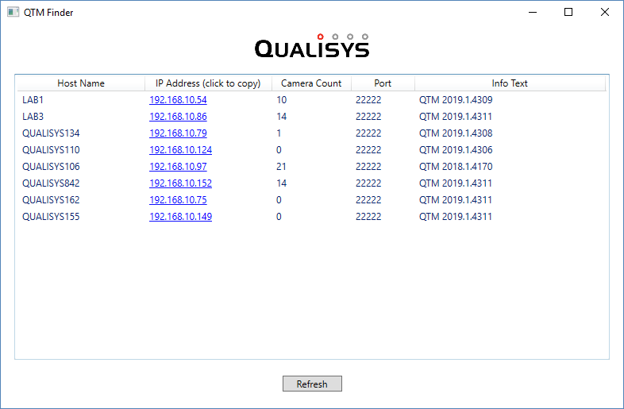

# QTMFinder

QTMFinder is a tiny Windows application that lists any QTM servers that are available for communication via real-time or REST protocols.

QTMFinder serves two purposes:

1) It's a small but useful utility to have when developing applications for mobile devices that connect to QTM, especially when discovery is not trivial to implement on the device and IP addresses on the local network may change over time.
2) It demonstrates the usage of the [Qualisys Realtime SDK for .Net](https://github.com/qualisys/RTClientSDK.Net) in a WPF application through a very simple yet complete example.
